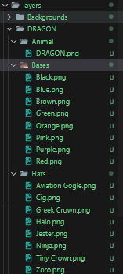

# Deanslist Core Candymachine

## Setup Instructions

Follow these steps to set up and run the Deanslist Core Candymachine:

1. **Setup Assets Folder**
   - Prepare the `assets` folder using one of the art engines.
   - Check metadata
   - Check collection metadata

   - Hashlip layer layout:


   - Hashlip config:
   ```ts
      // General metadata for Ethereum
   const namePrefix = "PERK";
   const description = "Get your IslandDAO Perk";
   const baseUri = "https://gateway.irys.xyz/";

   const solanaMetadata = {
   symbol: "PERKS",
   seller_fee_basis_points: 500, // Define how much % you want from secondary market sales 500 = 5%
   external_url: "https://x.com/deanslistDAO",
   "creators": [
      {
         "address": "FThth1Uwkw1JJKMkKohpgiEshYKZojMpfhGHMf2rLZNR", // Dean's List DAO Strategic Reserve
         "share": 100
      }
   ]
   };

   // If you have selected Solana then the collection starts from 0 automatically
   const layerConfigurations = [
   {
      growEditionSizeTo: 276,  // DRAGON
      layersOrder: [
         { name: "Backgrounds" },
         { name: "DRAGON/Bases", options: { displayName: "Colour" } },
         { name: "DRAGON/Hats", options: { displayName: "Hat" } },
         {name: "DRAGON/Animal", options: {displayName: "Animal"}}
      ],
   },
   {
      growEditionSizeTo: 552,  // GOAT
      layersOrder: [
         { name: "Backgrounds" },
         { name: "GOAT/Bases", options: { displayName: "Colour" } },
         { name: "GOAT/Hats", options: { displayName: "Hat" } },
         {name: "GOAT/Animal", options: {displayName: "Animal"}}
      ],
   },
   ...
   ```

1. **Generate Metadata**
   - Change the parameters to the right ones

   ```ts
   const RPC_ENDPOINT = 'https://api.devnet.solana.com';
   const IMAGES_FOLDER = './assetsDL/images';
   const JSON_FOLDER = './assetsDL/json';
   const WALLET_PATH = '{YOUR_WALLETPATH}';
   const OUTPUT_FILE = './uploaded_metadata.json';
   const UPLOAD_ZONE = 'https://gateway.irys.xyz/';
   const MAX_ITEMS = 50; // Limit the number of items processed
   ```

   - Run the script

      ```sh
      yarn metadata
      ```

2. **Create Collection**
   ```sh
   yarn collection
   ```
   - Copy the `collection_id` and paste it into `create_corecady.ts`.

3. **Create Candymachine**
   ```sh
   yarn candy
   ```
   - Copy the `candymachine_id` and paste it into `add_config_lines.ts`.

4. **Add Configuration Lines to Candy Machine**
   ```sh
   yarn addconfig
   ```

5. **Mint NFTs**
   ```sh
   yarn mint
   ```

6. **Fetch Assets**
   ```sh
   yarn asset
   ```

   - Get the `candyGuardId` and paste it in the **mintpage**

7. **Update Candy Guards**
   ```sh
   yarn updt
   ```

By following these steps, you will successfully set up and run the Deanslist Core Candymachine.